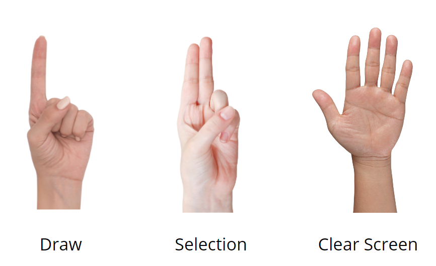

# Virtual Whiteboard
Using Python, Computer Vision and Google MediaPipe Libraries
Link to the toolkit design - [Canva Virtual Whiteboard UI](https://www.canva.com/design/DAEdq1bEIA4/q8qvATq6UcUWav4u6Moneg/view?utm_content=DAEdq1bEIA4&utm_campaign=designshare&utm_medium=link&utm_source=sharebutton)

## Installation Guide

### Clone GitHub Repository
 Open Command Prompt -->
`git clone https://github.com/viraj-lakshitha/ai-whiteboard-using-opencv.git`

### Install Required Packages and Libraries
```
pip upgrade --user pip
pip install opencv-python
pip install numpy
pip install mediapipe
```

### Run Project
Open project from PyCharm or suitable IDE and run the VirtualPainter.py file or Open Command Prompt and Run `python VirtualPainter.py`

## Guide


## Demo 
[](https://youtu.be/vF5HnA5sO6c "Virtual Whiteboard")
